# scala-basics

## Scala basics for beginners
---

### Scala Shell as a Calculator
---  

```
scala> 10 + 20 * 4 / 20
res0: Int = 14

scala> "10 + 20 * 4 / 20 = " + res0
res1: String = 10 + 20 * 4 / 20 = 14

scala> 100 - 33 / 6 % 5
res2: Int = 100

scala> "100 - 33 / 6 % 5 = " + res2
res3: String = 100 - 33 / 6 % 5 = 100

scala> 100 - ((33 / 6) + 1 ) % 5
res4: Int = 99

scala> "100 - ((33 / 6) + 1 ) % 5 = " + res4
res5: String = 100 - ((33 / 6) + 1 ) % 5 = 99
```
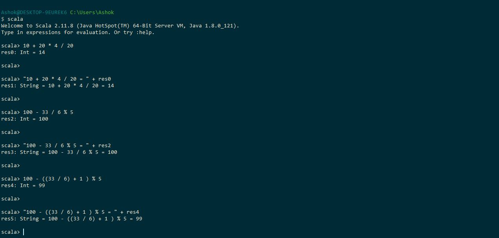
  

### Declaring a variable
---

There are two ways to declare a variable in Scala. Based on the data, it decides the Data Type. It also allows to give Data Type explicitly.

#### 1. Using val - Immutable: This value is not able to change
---

```
scala> val name = "Alice"
name: String = Alice

scala> val age = 25
age: Int = 25

scala> val gender = 'M'
gender: Char = M

scala> val salary = 25000.0
salary: Double = 25000.0

scala> val height = 5.6f
height: Float = 5.6

scala> val bool = true
bool: Boolean = true
```

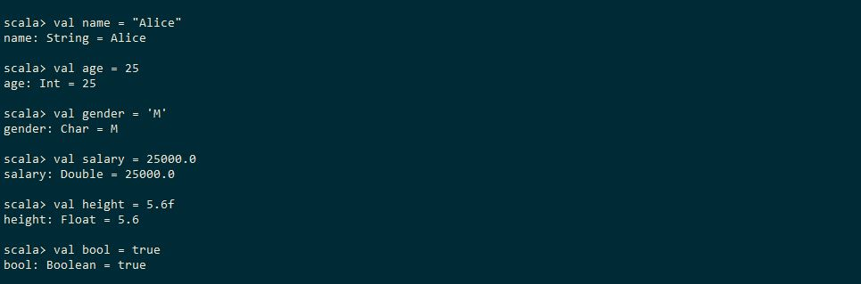

Example - Throws error when trying to assign a new value to val variable.

```
scala> val testVal = "Hi"
testVal: String = Hi

scala> testVal = "Hello"
<console>:12: error: reassignment to val
       testVal = "Hello"
               ^
```

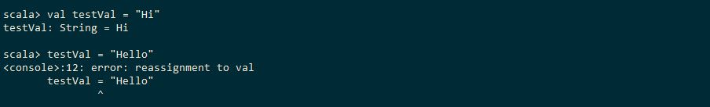

#### 2. Using var - Mutable: This value is able to change
---

```
scala> var name = "Alice"
name: String = Alice

scala> var age = 25
age: Int = 25

scala> var gender = 'M'
gender: Char = M

scala> var salary = 25000.0
salary: Double = 25000.0

scala> var height = 5.9f
height: Float = 5.9
```


Example - New values are assigned to the var variables

```
scala> name = "Amy"
name: String = Amy

scala> age = 22
age: Int = 22

scala> gender = 'F'
gender: Char = F

scala> salary = 30000.0
salary: Double = 30000.0

scala> height = 5.6f
height: Float = 5.6
```

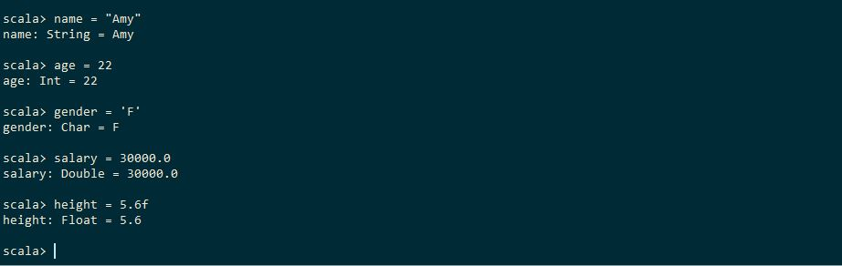

##### Declaring the variables with Data Types
---

```
scala> val name: String = "Alice"
name: String = Alice

scala> val age: Int = 25
age: Int = 25

scala> val gender: Char = 'M'
gender: Char = M

scala> val salary: Double = 25000.0
salary: Double = 25000.0

scala> val height: Float = 5.6f
height: Float = 5.6
```

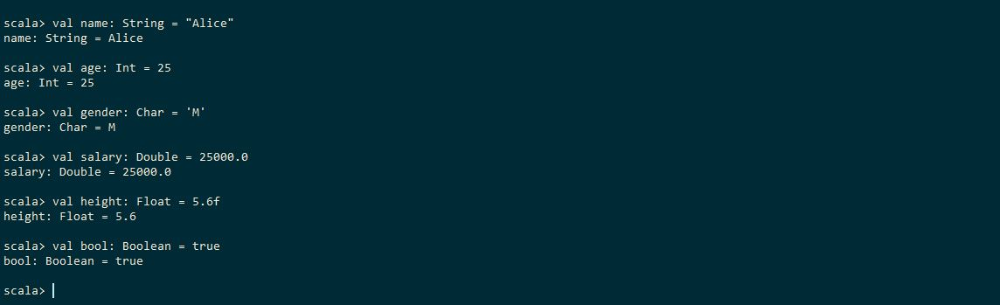

### Primitive Data Types in Scala:
---

Byte	: -128 to 127
Boolean	: true or false
Char	: Unsigned Max value 65535
Short	: -32768 to 32767
String	: Group of characters
Int		: -2147483648 to 2147483647
Long	: -9223372036854775808 to 9223372036854775807
Float	: -3.4028235E38 to 3.4028235E37
Double	: -1.7976931348623157E308 to 1.7976931348623157E307		(15 digits of precision)

##### BigInt	: It holds big integer numbers

```
scala> val largeNumber = BigInt("12423451254512331241243487345873265984752379473041048123542412341231434248375423")
largeNumber: scala.math.BigInt = 12423451254512331241243487345873265984752379473041048123542412341231434248375423

scala> largeNumber + 1
res0: scala.math.BigInt = 12423451254512331241243487345873265984752379473041048123542412341231434248375424

scala> largeNumber - 2
res1: scala.math.BigInt = 12423451254512331241243487345873265984752379473041048123542412341231434248375421
```

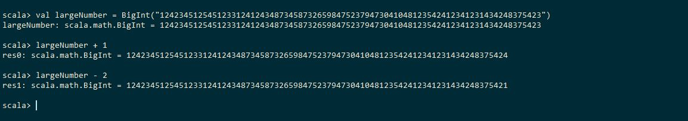

##### BigDecimal	It hold big decimal number with high precision

```
scala> val largeDecimal = BigDecimal("3.14333333333333333333333333333333333333333333333333333333333333333333333")
largeDecimal: scala.math.BigDecimal = 3.14333333333333333333333333333333333333333333333333333333333333333333333

scala> val largeDecimal2 = BigDecimal("0.00000000000000000000000000000000000000000000000000000000000000000000001")
largeDecimal2: scala.math.BigDecimal = 1E-71

scala> largeDecimal + largeDecimal2
res3: scala.math.BigDecimal = 3.14333333333333333333333333333333333333333333333333333333333333333333334
```

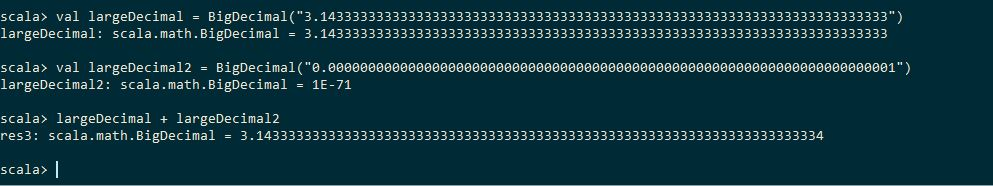

### Single line comments: Two forward slashes (//)
---

`// This is a single line comment`

### Multi Line comments: Start with (/*) and close with (*/)
---

```
/*
	This is a multi line comment
	This is a multi line comment
	This is a multi line comment
*/
```

### Arithmetic Operations: (+, -, *, /, %)
---

```
scala> val num1 = 100
num1: Int = 100

scala> val num2 = 3
num2: Int = 3
```

##### Addition (+)

```
scala> "num1 + num2 = " + (num1 + num2)
res4: String = num1 + num2 = 103
```

##### Substraction (-)

```
scala> "num1 - num2 = " + (num1 - num2)
res5: String = num1 - num2 = 97
```

##### Multiplication (*)

```
scala> "num1 * num2 = " + (num1 * num2)
res6: String = num1 * num2 = 300
```

##### Division

```
scala> "num1 / num2 = " + (num1 / num2)
res7: String = num1 / num2 = 33
```

##### Modulus

```
scala> "num1 % num2 = " + (num1 % num2)
res8: String = num1 % num2 = 1
```

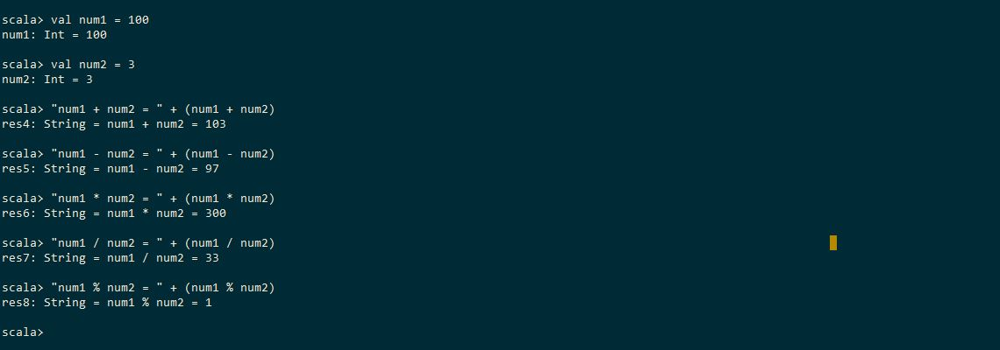

##### Increment, Decrement, Multiply, Divide and Modulus

```
scala> var someInteger = 15
someInteger: Int = 15

scala> someInteger += 1

scala> someInteger
res10: Int = 16

scala> someInteger -= 2

scala> someInteger
res12: Int = 14

scala> someInteger *= 3

scala> someInteger
res14: Int = 42

scala> someInteger /= 4

scala> someInteger
res16: Int = 10

scala> someInteger %= 6

scala> someInteger
res18: Int = 4
```

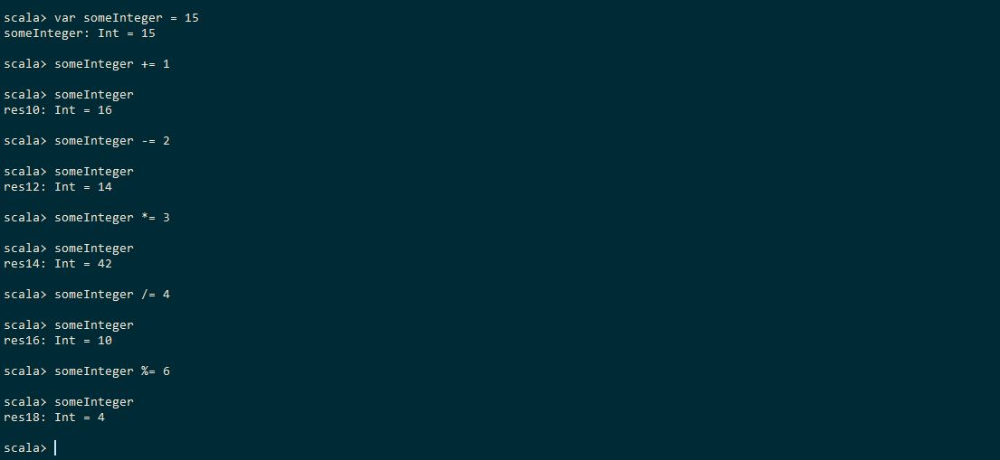

### Conditional Operators: 
---

	Equals To ==
	Not Equals To !=
	Less Than <
	Greater Than >
	Less Than or Equals To <=
	Greater Than or Equals To >=

### Logical Operators: 
---

	AND &&
	OR ||
	NOT !

#### IF / IF ELSE Statement

```
if(age <= 12) {
  println("Kid")
} else if((age > 12) && (age <= 21)) {
  println("Teenage")
} else if((age > 21) && (age <= 32)) {
  println("Young")
} else if((age > 33) && (age <= 45)) {
  println("Middle Age")
} else if ((age > 45) && (age <= 100)) {
  println("Senior Citizen")
} else if((age == 0) || (age > 100)) {
  println("Age should be an Integer Value")
} else {
  println("No Condition satisfied")
}
```

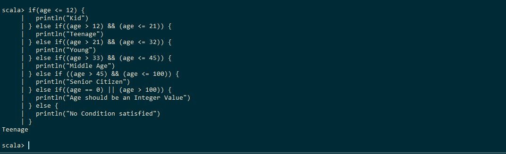

#### WHILE Statement

```
scala> var i = 1
i: Int = 1

scala> while (i <= 10) {
     |   println("i = " + i)
     |   i += 1
     | }
i = 1
i = 2
i = 3
i = 4
i = 5
i = 6
i = 7
i = 8
i = 9
i = 10
```

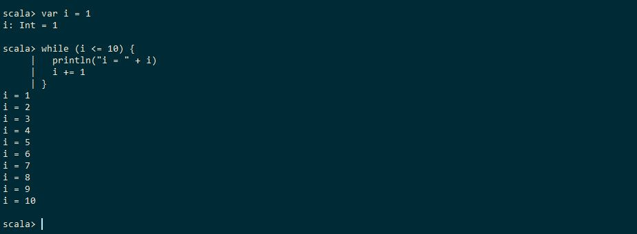

#### DO WHILE Statement		Execute atleast once even if the given condition not satisfy

```
scala> var i = 1
i: Int = 1

scala> do {
     |  println("i = " + i)
     |  i += 1
     | } while (i <= 10)
i = 1
i = 2
i = 3
i = 4
i = 5
i = 6
i = 7
i = 8
i = 9
i = 10

scala> var i = 11
i: Int = 11

scala> do {
     |   println("i = " + i)
     |   i += 1
     | } while (i <= 10)
i = 11
```

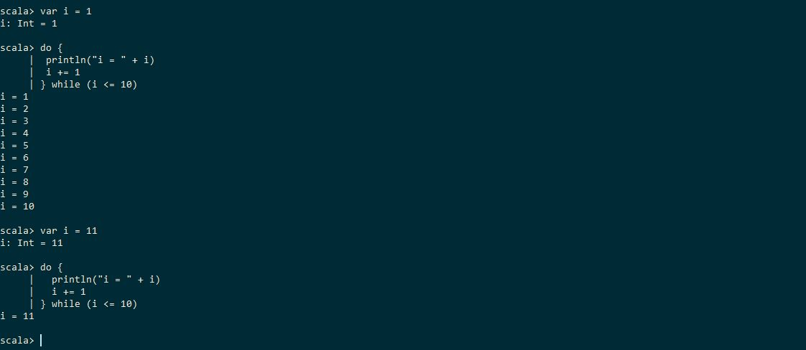

#### FOR Statement

```
scala> for(i <- 1 to 10) {
     |   println("i = " + i)
     | }
i = 1
i = 2
i = 3
i = 4
i = 5
i = 6
i = 7
i = 8
i = 9
i = 10
```


```
scala> val name = "ScalaTutorial"
name: String = ScalaTutorial

scala> for(i <- 0 until name.length) {
     |   println("Position = " + i + ", Letter = " + name(i))
     | }
Position = 0, Letter = S
Position = 1, Letter = c
Position = 2, Letter = a
Position = 3, Letter = l
Position = 4, Letter = a
Position = 5, Letter = T
Position = 6, Letter = u
Position = 7, Letter = t
Position = 8, Letter = o
Position = 9, Letter = r
Position = 10, Letter = i
Position = 11, Letter = a
Position = 12, Letter = l
```

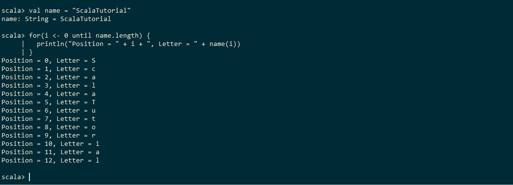

```
scala> val list = List(1, 2, 3, 4, 5, 6)
list: List[Int] = List(1, 2, 3, 4, 5, 6)

scala> for(i <- list) {
     |   println("Element = " + i)
     | }
Element = 1
Element = 2
Element = 3
Element = 4
Element = 5
Element = 6
```

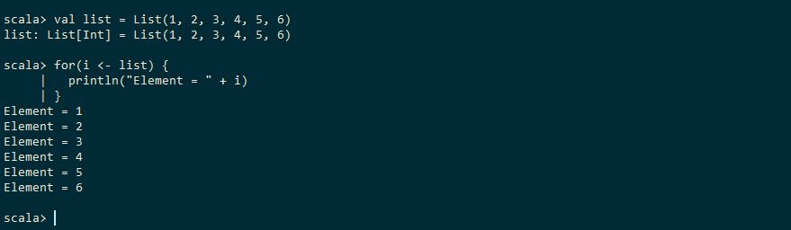

```
scala> val list = List(1, 2, 3, 4, 5, 6, 7, 8, 9, 10)
list: List[Int] = List(1, 2, 3, 4, 5, 6, 7, 8, 9, 10)

scala> val evenList = for { i <- list
     |   if (i % 2) == 0
     | } yield i
evenList: List[Int] = List(2, 4, 6, 8, 10)

scala> for(i <- evenList) {
     |   println("Element = " + i)
     | }
Element = 2
Element = 4
Element = 6
Element = 8
Element = 10

scala> val evenList = for { i <- list; if (i % 2) == 0} yield i
evenList: List[Int] = List(2, 4, 6, 8, 10)

scala> for(i <- evenList) {
     |   println("Element = " + i)
     | }
Element = 2
Element = 4
Element = 6
Element = 8
Element = 10
```

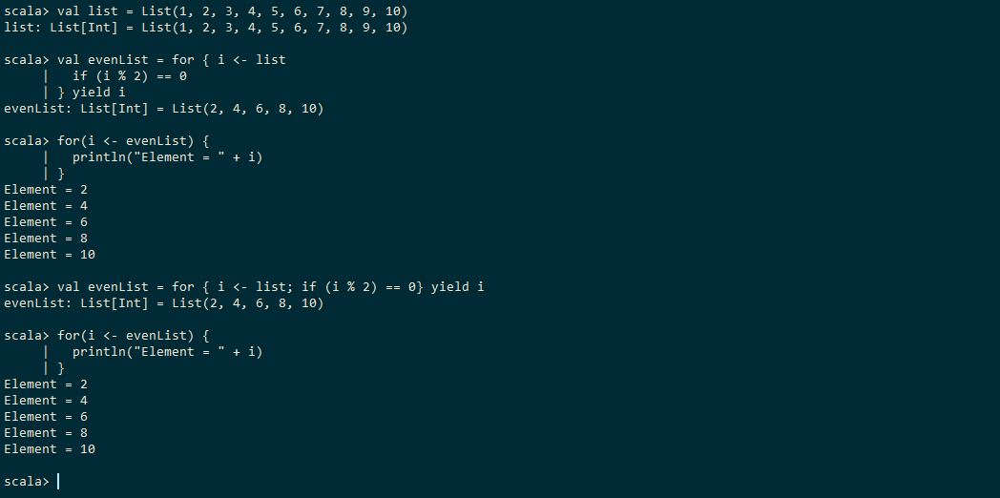

```
scala> for(i <- 1 to 3; j <- 4 to 6) {
     |   println("i = " + i)
     |   println("j = " + j)
     | }
i = 1
j = 4
i = 1
j = 5
i = 1
j = 6
i = 2
j = 4
i = 2
j = 5
i = 2
j = 6
i = 3
j = 4
i = 3
j = 5
i = 3
j = 6
```

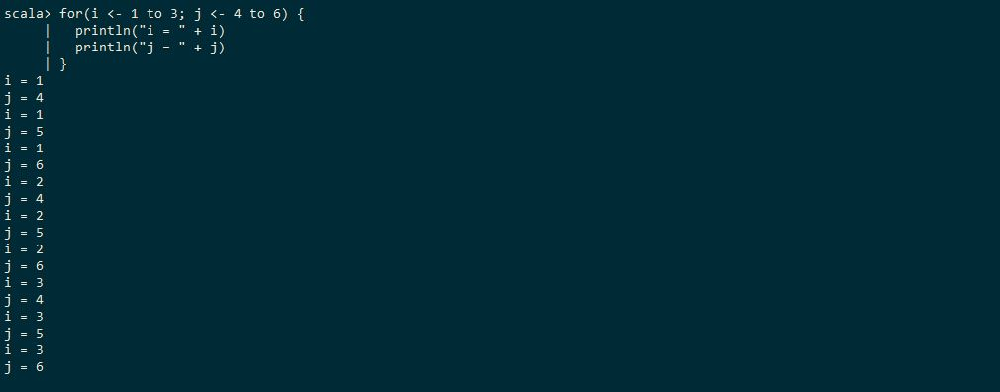

### FUNCTIONS:
---

```
scala> def printHello(): Unit = {
     |   println("Hello World")
     | }
printHello: ()Unit

scala> printHello
Hello World
```

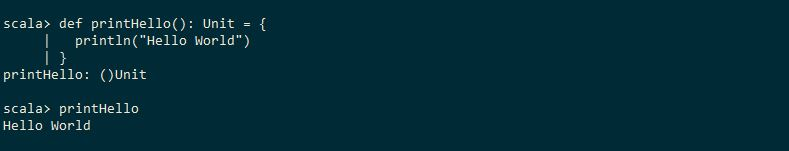

```
scala> def add(a: Int, b: Int): Unit = {
     |   println("Addition (" + a + " + " + b + ") = " + (a + b))
     | }
add: (a: Int, b: Int)Unit

scala> add(4, 5)
Addition (4 + 5) = 9
```

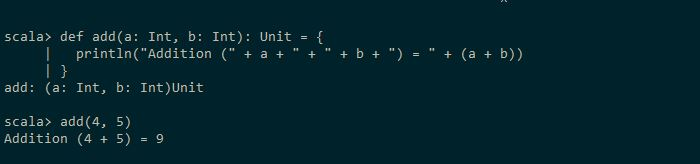

```
scala> def getAdditionValue(a: Int, b: Int): Int = {
     |   val addValue = a + b
     |   addValue
     | }
getAdditionValue: (a: Int, b: Int)Int

scala> getAdditionValue(6, 7)
res48: Int = 13

scala> println("Addition (6 + 7) = " + getAdditionValue(6, 7))
Addition (6 + 7) = 13
```

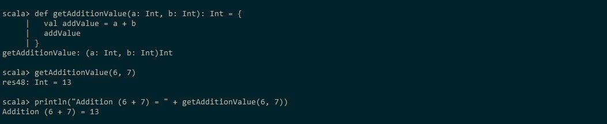

### USER INPUT:
---

	readBoolean		Read the input as a Boolean
	readByte		Read the input as Byte
	readChar		Read the input as a Character
	readDouble		Read the input as a Double
	readFloat		Read the input as a Float
	readInt			Read the input as an Integer
	readLine		Read the input as a String
	readLong		Read the input as a Long
	readShort		Read the input as a Short

```
scala> import scala.io.StdIn._
import scala.io.StdIn._

scala> def checkNumber(): Unit = {
     |   println("Enter a Number of your choice :: ")
     |   val inputNumber = readLine().toInt
     |   if( inputNumber % 2 == 0)
     |     println("The Input Number " + inputNumber + " is an Even Number")
     |   else
     |     println("The Input Number " + inputNumber + " is an Odd Number")
     | }
checkNumber: ()Unit

scala> checkNumber
Enter a Number of your choice ::
The Input Number 123 is an Odd Number
```

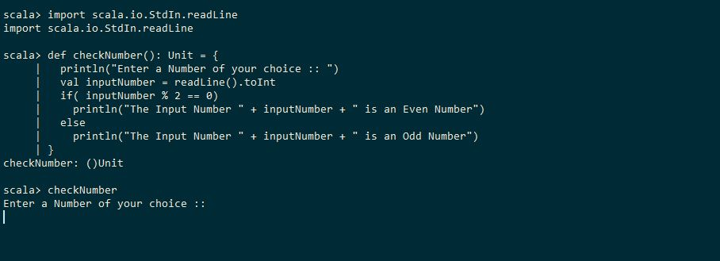
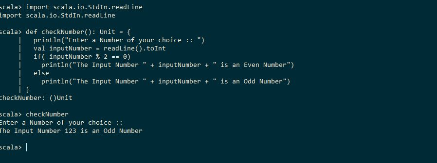

### OUTPUT DATA:
---

	%c		Character
	%d		Integer
	%f		Float
	%s		String

```
scala> val name = "Alice"
name: String = Alice

scala> val age = 25
age: Int = 25

scala> val height = 5.8
height: Double = 5.8

scala> val gender = 'M'
gender: Char = M

scala> val salary = 20000.0f
salary: Float = 20000.0

scala> println("Name :: " + name + ", Age :: " + age + ", Gender :: " + gender + ", Salary :: " + salary)
Name :: Alice, Age :: 25, Gender :: M, Salary :: 20000.0

scala> println(s"Name :: $name, Age :: $age, Gender :: $gender, Salary :: $salary")
Name :: Alice, Age :: 25, Gender :: M, Salary :: 20000.0

scala> printf(f"Name :: ${name}, Age :: ${age + 1}, Gender :: ${gender}, Salary :: $salary%.3f\n")
Name :: Alice, Age :: 26, Gender :: M, Salary :: 20000.000

scala> printf("Name :: %s, Age :: %d, Gender :: %c, Salary :: %.2f\n", name, age, gender, salary)
Name :: Alice, Age :: 25, Gender :: M, Salary :: 20000.00

scala> printf("Name :: %s, \nAge :: %d, \tGender :: %c, \nSalary :: %.2f\n", name, age, gender, salary)
Name :: Alice,
Age :: 25,      Gender :: M,
Salary :: 20000.00

scala> printf("Name :: %-10s, Age :: '%05d', Gender :: '%5c', Salary :: %.5f\n", name, age, gender, salary)
Name :: Alice     , Age :: '00025', Gender :: '    M', Salary :: 20000.00000
```

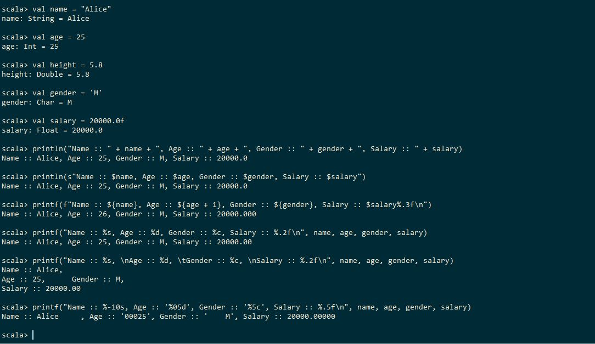